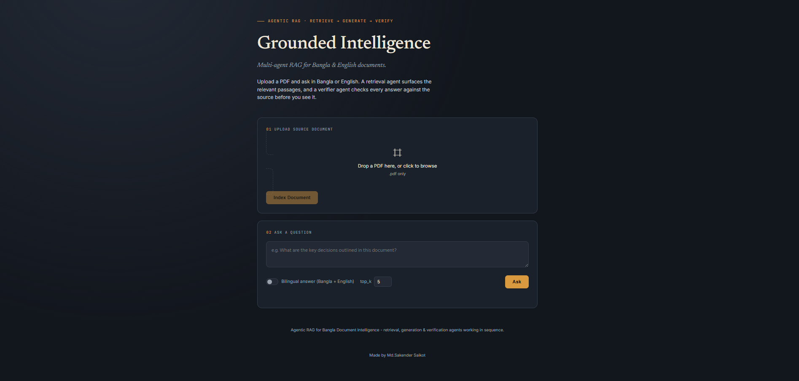
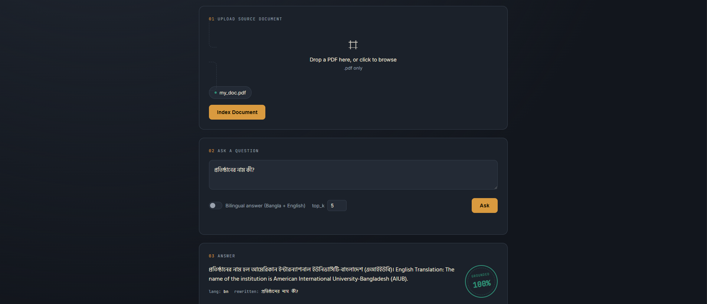
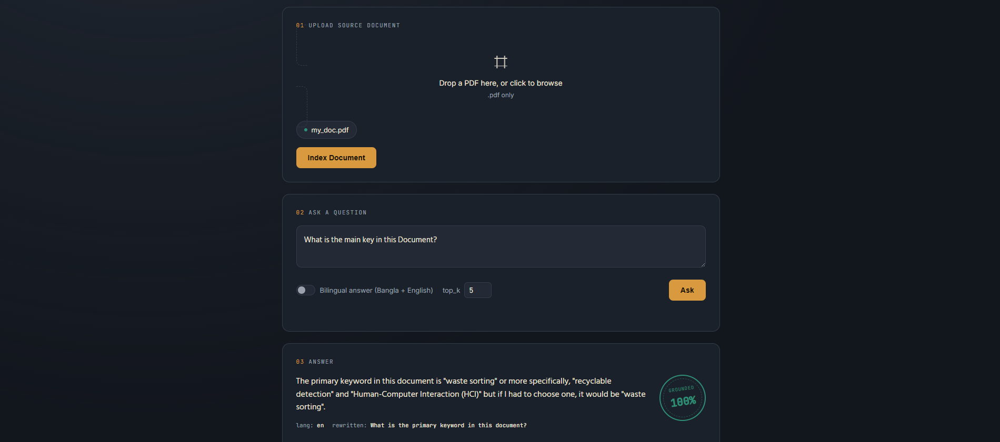
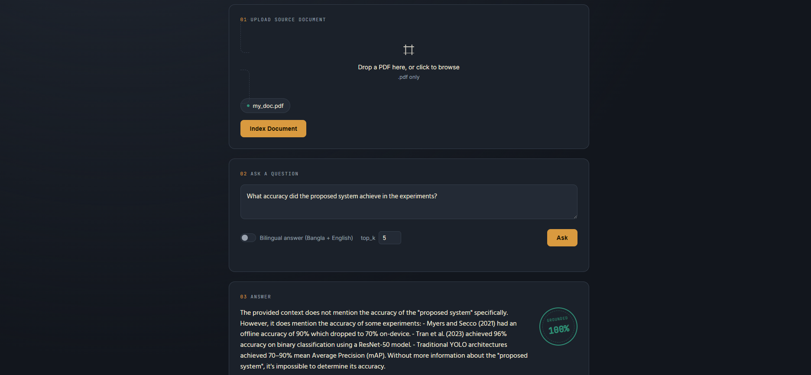
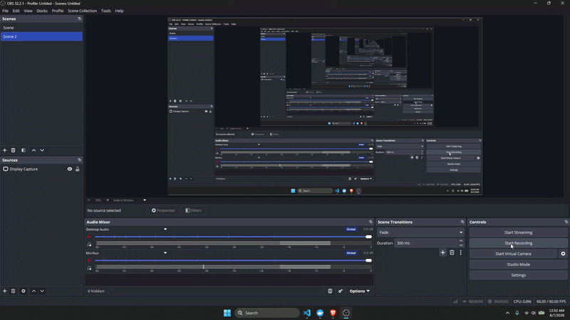

# Agentic RAG for Bangla Document Intelligence

**A multi-agent Retrieval-Augmented Generation (RAG) system with native Bangla + English
(bilingual) document understanding — retrieval, generation, and answer-verification agents
working together to reduce hallucination, with a self-hosted UI.**


-F55036)


---

## Table of Contents

- [Why "agentic" and not plain RAG?](#why-agentic-and-not-plain-rag)
- [Demo / Screenshots](#demo--screenshots)
- [Architecture](#architecture)
- [Bilingual (Bangla + English) Support](#bilingual-bangla--english-support)
- [Tech Stack](#tech-stack)
- [Frontend](#frontend)
- [API Reference](#api-reference)
- [Project Layout](#project-layout)
- [Quickstart](#quickstart)
- [Docker](#docker)
- [Engineering Challenges & Solutions](#engineering-challenges--solutions)
- [Switching to a Local Open-Source LLM](#switching-to-a-local-open-source-llm-later)
- [Scope & Honesty Notes](#scope--honesty-notes)

---

## Why "agentic" and not plain RAG?

Instead of a single retrieve → generate call, the pipeline is split into **four cooperating
agents**, each with one job. This reduces hallucination and makes each stage independently
debuggable, testable, and swappable — a plain RAG call is a black box; this isn't.

1. **Query Understanding Agent** — detects language (Bangla / English / mixed), rewrites and
   expands the query, and produces a translated version for cross-lingual retrieval.
2. **Retrieval Agent** — embeds the (possibly rewritten) query with a multilingual embedding
   model and retrieves the top-k chunks from FAISS. Searches in both Bangla and English
   phrasings when the document corpus is mixed-language, then merges results.
3. **Answer Generation** — an LLM call that synthesizes an answer strictly grounded in the
   retrieved context, in the same language the user asked in (or bilingually, on request).
4. **Verifier / Fact-Check Agent** — takes the draft answer and the retrieved chunks and checks
   whether every claim is actually supported by the context. If not, it flags the unsupported
   claims and the orchestrator triggers **one retry** with a wider retrieval window.

The **Orchestrator Agent** wires these together as a simple, explicit state machine (see
[`app/agents/orchestrator.py`](app/agents/orchestrator.py)) — intentionally framework-free
(no LangChain/LlamaIndex required) so the control flow stays easy to read and debug. Each
function maps 1:1 to a LangChain `Runnable` / LlamaIndex `QueryPipeline` step if you'd rather
plug into that ecosystem later.

```
                 ┌──────────────────────┐
   User Query    │   Orchestrator Agent  │
  (Bangla/EN) ──▶│   (state machine)     │
                 └──────────┬────────────┘
                             │
       ┌─────────────────────┼──────────────────────┐
       ▼                      ▼                       ▼
┌───────────────┐    ┌────────────────┐      ┌─────────────────┐
│ Query          │    │ Retrieval       │      │ Answer           │
│ Understanding   │──▶│ Agent (FAISS)   │──▶  │ Generation (LLM) │
│ Agent           │    │                 │      │                  │
└───────────────┘    └────────────────┘      └────────┬─────────┘
                                                          │
                                                          ▼
                                                ┌────────────────────┐
                                                │ Verifier /          │
                                                │ Fact-Check Agent    │
                                                └──────────┬──────────┘
                                                            │
                                          not grounded?     │  grounded
                                          (retry, max 1)◀───┴───▶ return to user
```

---

## Demo / Screenshots

  
  
  
  

> The forth example is the important one - it shows the verifier agent actually catching an
> answer that isn't supported by the retrieved context, rather than only demoing the happy path.

  

---

## Architecture

| Stage | Responsibility | Implementation |
|---|---|---|
| Query Understanding | Language detection, query rewrite, cross-lingual translation | LLM call (Groq) + fast Unicode-ratio heuristic |
| Retrieval | Embed query, vector search, merge bilingual results | `multilingual-e5-base` + FAISS |
| Generation | Draft an answer strictly from retrieved context | LLM call (Groq, Llama 3.x) |
| Verification | Score groundedness, flag unsupported claims, decide on retry | LLM-as-judge call (Groq) |
| Orchestration | Sequence the above, retry once on low confidence | Plain Python state machine, no framework |

---

## Bilingual (Bangla + English) Support

- **Embeddings**: [`intfloat/multilingual-e5-base`](https://huggingface.co/intfloat/multilingual-e5-base)
  — maps Bangla and English into the same vector space, so a Bangla question can retrieve
  relevant English passages and vice versa.
- **Document loading**: PDF text extraction preserves Bangla Unicode; chunking is
  sentence-aware for Bangla (splits on `।` as well as `.` / `?` / `!`).
- **Query language detection**: a fast heuristic (Bangla Unicode block ratio) — no extra API
  call needed just to detect language.
- **Answering**: the LLM is instructed to answer in the query's language, and can optionally
  produce a bilingual (Bangla + English) answer in a single response.

---

## Tech Stack

| Layer | Choice |
|---|---|
| Backend API | FastAPI |
| Vector store | FAISS (local, on-disk) |
| Embeddings | `sentence-transformers` — `multilingual-e5-base` |
| LLM | Groq API (Llama 3.x / Mixtral), pluggable to a local Hugging Face model |
| PDF parsing | `pypdf`, Unicode-safe for Bangla |
| Frontend | Vanilla HTML / CSS / JS, served directly by FastAPI (no build step) |
| Deployment | Docker + docker-compose |

---

## Frontend

A single-page UI is served directly by FastAPI at `/` (files in
[`app/static/`](app/static/) — `index.html`, `style.css`, `script.js`, no build step or
framework needed):

- Drag-and-drop PDF upload, indexed straight into FAISS.
- A question composer with a bilingual-answer toggle and adjustable `top_k`.
- A results view showing the answer, detected language, retrieved passages with similarity
  scores, and a **grounding seal** — a visual stamp of the verifier agent's `is_grounded`
  verdict and confidence score, red when the answer is flagged as unsupported.

---

## API Reference

| Method | Endpoint | Description |
|---|---|---|
| `GET` | `/` | Serves the web UI |
| `POST` | `/upload` | Upload a PDF; chunks, embeds, and indexes it into FAISS |
| `POST` | `/query` | Ask a question; runs the full agent pipeline and returns a grounded, verified answer |
| `GET` | `/docs` | Interactive Swagger API docs (auto-generated by FastAPI) |

Full request/response schemas are in [`app/schemas.py`](app/schemas.py).

---

## Project Layout

```
agentic-rag-bangla/
├── app/
│   ├── main.py                  # FastAPI app: /, /upload, /query
│   ├── config.py                 # env-based settings
│   ├── schemas.py                # Pydantic request/response models
│   ├── static/                   # self-hosted frontend
│   │   ├── index.html
│   │   ├── style.css
│   │   └── script.js
│   ├── agents/
│   │   ├── orchestrator.py       # wires all agents together
│   │   ├── query_agent.py        # language detect + query rewrite/expand
│   │   ├── retrieval_agent.py    # embed + FAISS search + merge/re-rank
│   │   └── verifier_agent.py     # hallucination / groundedness check
│   └── core/
│       ├── document_loader.py    # PDF -> bilingual-aware chunks
│       ├── embeddings.py         # multilingual embedding wrapper
│       ├── vector_store.py       # FAISS index wrapper
│       └── llm_client.py         # Groq / local HF LLM interface
├── sample_data/                  # put a sample Bangla PDF here to test
├── screenshots/                  # README images/GIF
├── tests/
│   └── test_basic.py
├── requirements.txt
├── Dockerfile
├── docker-compose.yml
├── .env.example
└── README.md
```

---

## Quickstart

```bash
cp .env.example .env
# edit .env and add GROQ_API_KEY (free at https://console.groq.com)

pip install -r requirements.txt
uvicorn app.main:app --reload --port 8000
```

Then open **http://localhost:8000** for the UI, or use the API directly:

```bash
# Upload a Bangla or English PDF
curl -F "file=@sample_data/your_doc.pdf" http://localhost:8000/upload

# Ask a question in Bangla
curl -X POST http://localhost:8000/query \
  -H "Content-Type: application/json" \
  -d '{"question": "এই ডকুমেন্টে মূল বিষয়বস্তু কী?"}'

# Ask in English
curl -X POST http://localhost:8000/query \
  -H "Content-Type: application/json" \
  -d '{"question": "What is the main topic of this document?"}'
```

Interactive API docs: **http://localhost:8000/docs**

---

## Docker

```bash
docker compose up --build
```

The embedding model is preloaded at container startup (see `app/main.py`'s startup hook), so
the first request after boot isn't slowed down by an on-demand model download.

---

## Engineering Challenges & Solutions

- **Cross-lingual retrieval mismatch** — a Bangla question over an English-heavy document (or
  vice versa) can fail to retrieve relevant chunks if query and passage embeddings don't share
  a common space. Solved by using a multilingual embedding model (`multilingual-e5-base`) that
  maps both languages into the same vector space, plus a query-rewriting step that also
  generates a translated version of the query for cross-lingual search.
- **LLM hallucination** — a generated answer can drift from what the retrieved context actually
  supports. Solved with a dedicated verifier agent that scores groundedness against the
  retrieved passages, flags unsupported claims explicitly, and triggers one automatic retry
  (with a wider retrieval window) on a low-confidence verdict instead of silently returning an
  unverified answer.
- **Bangla-aware chunking** — naive chunking on `.`/`?`/`!` breaks Bangla sentences, since Bangla
  uses `।` (dari) as its primary sentence terminator. Chunking is sentence-aware across both
  punctuation sets to avoid splitting mid-sentence and losing context.
- **Slow first request after deploy** — the embedding model was originally lazy-loaded on first
  use, making the first upload/query after a cold start noticeably slow. Fixed by preloading the
  model in a FastAPI startup hook so the cost is paid once at container boot, not per-request.

---

## Switching to a Local Open-Source LLM Later

1. Set `LLM_PROVIDER=local` in `.env`.
2. Set `LOCAL_MODEL_NAME` (e.g. `mistralai/Mistral-7B-Instruct-v0.3`).
3. Make sure you have a CUDA GPU + `bitsandbytes` installed for 4-bit quantized loading
   (already in `requirements.txt`, commented — uncomment for local use).
4. First run will download the model from Hugging Face (needs internet + an HF auth token for
   gated models — set `HF_TOKEN` in `.env`).

---

## Scope & Honesty Notes

This project is fully wired end-to-end and runnable with just a Groq API key — no GPU needed.
The verifier agent uses a lightweight LLM-as-judge groundedness check rather than a trained
classifier, which is good enough for a demo but is the clear place to extend with a proper NLI
model (e.g. `csebuetnlp/banglabert` fine-tuned for entailment) for a cheaper, more consistent
check in a production setting.
